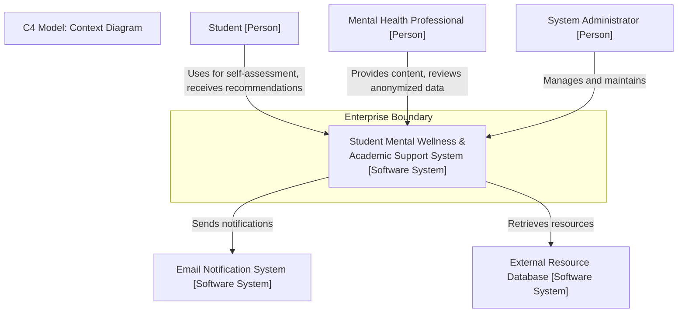

### C4 Model: Context Diagram

```mermaid
graph TD
    title[C4 Model: Context Diagram]
    Student["Student [Person]"]
    MentalHealthProfessional["Mental Health Professional [Person]"]
    Administrator["System Administrator [Person]"]
    SMWASS["Student Mental Wellness &\nAcademic Support System [Software System]"]
    EmailSystem["Email Notification System [Software System]"]
    ResourceDB["External Resource Database [Software System]"]
    
    Student -->|Uses for self-assessment, receives recommendations| SMWASS
    MentalHealthProfessional -->|Provides content, reviews anonymized data| SMWASS
    Administrator -->|Manages and maintains| SMWASS
    SMWASS -->|Sends notifications| EmailSystem
    SMWASS -->|Retrieves resources| ResourceDB
    
    subgraph "Enterprise Boundary"
        SMWASS
    end

```
