# Architecture Documentation

## Project Title
Student Mental Wellness & Academic Support System

## Domain
Domain for the system: **Education**

This system operates at the intersection of educational technology and mental health support, focused specifically on the academic environment. It targets higher education institutions, including universities and colleges, where academic pressure and stress are particularly high.

## Problem Statement
Students face significant mental health challenges, especially during examination periods, which directly impact their academic performance. Current educational systems often fail to adequately address the connection between mental wellbeing and academic success. Students experiencing stress, anxiety, and emotional difficulties struggle with concentration, experience burnout, and ultimately achieve lower grades than their potential would suggest.

The **Student Mental Wellness & Academic Support System** aims to bridge this gap by providing timely intervention, personalized support, and practical strategies to help students manage their mental health while improving their academic outcomes.

## Individual Scope
This project is feasible for individual implementation due to its modular architecture and focused scope:

1. **Core Functionality**: The system will focus on three key components:
   - Mental health self-assessment tools
   - Personalized study technique recommendations
   - Stress management resources

2. **Technical Implementation**:
   - Web-based application with responsive design
   - Backend database for user profiles and assessment data
   - Algorithm for personalized recommendations based on assessment results

## C4 Model Architectural Documentation

### Context Diagram
The context diagram shows the overall system and its interactions with external actors and systems:
- **Primary Users**: Students seeking mental health support and academic guidance
- **Secondary Users**: Content administrators who develop and manage general well-being, stress management, and mindfulness resources
- **System Administrators**: Technical staff who maintain the system
- **External Systems**: Email notification system and referral services for students with serious mental health concerns.

```mermaid
graph TD
    Student["👨‍🎓 Student<br>[Person]"]:::personStyle
    ContentAdmin["👩‍💼 Content Administrator<br>[Person]"]:::personStyle
    Administrator["👨‍💻 System Administrator<br>[Person]"]:::personStyle
    SMWASS["🧠 Student Mental Wellness<br>& Academic Support System<br>[Software System]"]:::mainSystemStyle
    EmailSystem["✉️ Email Notification System<br>[Software System]"]:::externalSystemStyle
    ReferralServices["🏥 Mental Health Referral Services<br>[Software System]"]:::externalSystemStyle
    
    Student -->|Uses for self-assessment,<br>receives recommendations| SMWASS
    ContentAdmin -->|Manages wellness content| SMWASS
    Administrator -->|Manages and maintains| SMWASS
    SMWASS -->|Sends notifications| EmailSystem
    SMWASS -->|Provides referrals when needed| ReferralServices
    
    subgraph EnterpriseBoundary["Enterprise Boundary"]
        SMWASS
    end
    
    classDef personStyle fill:#08427B,stroke:#052E56,color:#fff,shape:circle
    classDef mainSystemStyle fill:#1168BD,stroke:#0B4884,color:#fff
    classDef externalSystemStyle fill:#999999,stroke:#6B6B6B,color:#fff
    classDef boundaryStyle fill:none,stroke:#888888,color:#fff,stroke-dasharray:5 5
    
    class EnterpriseBoundary boundaryStyle
```


### Container Diagram
The container diagram breaks down the system into its major components:
- **Web Application**: Primary interface for students and administrators
- **API Gateway**: Central access point for all services
- **Authentication Service**: Handles user registration, login, and security
- **Assessment Service**: Manages and processes mental health self-assessments
- **Recommendation Engine**: Generates personalized suggestions based on assessment results
- **User Database**: Stores user profiles and assessment history
- **Content Database**: Stores educational resources and recommendation content
- **Referral Service**: Provides information on professional mental health resources for students whose assessment results indicate serious concerns

```mermaid
flowchart TD
    Student["👨‍🎓 Student<br>[Person]"]:::personStyle
    ContentAdmin["👩‍💼 Content Administrator<br>[Person]"]:::personStyle
    Administrator["👨‍💻 System Administrator<br>[Person]"]:::personStyle
    EmailSystem["✉️ Email Notification System<br>[Software System]"]:::externalSystemStyle
    ReferralServices["🏥 Mental Health Referral Services<br>[Software System]"]:::externalSystemStyle
    
    subgraph SMWASS["🧠 Student Mental Wellness & Academic Support System"]
        WebApp["💻 Web Application<br>[Container: JavaScript/React]"]:::containerStyle
        API["🔌 API Service<br>[Container: Node.js/Express]"]:::containerStyle
        AssessmentEngine["📊 Assessment Engine<br>[Container: Python]"]:::containerStyle
        RecommendationEngine["🧩 Recommendation Engine<br>[Container: Python]"]:::containerStyle
        NotificationService["📨 Notification Service<br>[Container: Node.js]"]:::containerStyle
        Database["🗄️ Database<br>[Container: MongoDB]"]:::containerStyle
    end
    
    Student -->|"Uses for self-assessment,<br>receives recommendations"| WebApp
    ContentAdmin -->|"Manages wellness content"| WebApp
    Administrator -->|"Manages and maintains"| WebApp
    Administrator -->|"Configures and monitors"| API
    
    WebApp -->|"Makes API requests"| API
    API -->|"Processes assessments"| AssessmentEngine
    API -->|"Generates recommendations"| RecommendationEngine
    API -->|"Triggers notifications"| NotificationService
    AssessmentEngine -->|"Stores/retrieves data"| Database
    RecommendationEngine -->|"Stores/retrieves data"| Database
    NotificationService -->|"Sends email notifications"| EmailSystem
    API -->|"Provides referrals when needed"| ReferralServices
    
    classDef personStyle fill:#08427B,stroke:#052E56,color:#fff
    classDef containerStyle fill:#438DD5,stroke:#2E6295,color:#fff
    classDef externalSystemStyle fill:#999999,stroke:#6B6B6B,color:#fff
    
    style SMWASS fill:none,stroke:#1168BD,color:#1168BD,stroke-width:2px
```


### Component Diagrams
The component diagrams detail the internal workings of key containers:

#### Web Application Components
- **User Interface**: Provides the main presentation layer for student interaction
- **Admin Portal (React)**: Specialized interface for content administrators and system management
- **Assessment Component (React)**: Delivers self-assessment tools and questionnaires
- **Resource Component (React)**: Provides access to educational and mental health content
- **Disclaimer Component (React)**: Clearly communicates system limitations and appropriate use guidelines
- **Referral Component (React)**: Facilitates connections to professional mental health services
- **Notification Component (React)**: Manages user alerts, reminders, and communications
- **API Client (Axios)**: Handles all communication with backend services
#### API Service Container
- **Router Component**: Directs requests to appropriate controllers
- **Authentication Middleware**: Validates user tokens
- **User Controller**: Handles user-related operations
- **Assessment Controller**: Manages assessment data
- **Recommendation Controller**: Retrieves personalized recommendations
- **Resource Controller**: Accesses educational content
- **Notification Controller**: Sends alerts and reminders
- **Scheduler Controller**: Manages study schedule creation and updates
- **Logging Middleware**: Records system activity
- **Referral Controller**: Manages access to mental health referral resources
- **Router (Express)**: Directs incoming requests to appropriate controllers
- **Auth Controller (Node.js)**: Manages user authentication and authorization
- **Assessment Controller (Node.js)**: Processes assessment data and requests
- **Recommendation Controller (Node.js)**: Handles personalized recommendation generation
- **Referral Controller (Node.js)**: Manages professional service referral
- **Notification Controller (Node.js)**: Coordinates system notifications and alerts
#### Notification Service
- **Email Service (Node.js)**: Processes and sends email communications
- **Notification Queue (Redis)**: Manages asynchronous notification processing
- **Template Engine (Handlebars)**: Formats messages using standardized templates
#### Assessment Engine
- **Processor (Python)**: Coordinates assessment data processing
- **Scoring Module (Python)**: Analyzes and evaluates assessment responses
- **Validation Module (Python)**: Ensures data integrity and consistency
#### Recommendation Engine
- **Processor (Python)**: Orchestrates the recommendation generation process
- **Content Matcher (Python)**: Aligns user needs with appropriate resources
- **Priority Module (Python)**: Determines recommendation urgency and relevance

```mermaid
flowchart TD
    Student["👨‍🎓 Student [Person]"]:::personStyle
    ContentAdmin["👩‍💼 Content Admin [Person]"]:::personStyle
    Administrator["👨‍💻 Admin [Person]"]:::personStyle
    
    subgraph WebApp["💻 Web Application Container"]
        UIComponent["🖥️ User Interface [React]"]:::componentStyle
        AdminComponent["⚙️ Admin Portal [React]"]:::componentStyle
        AssessmentComponent["📝 Assessment [React]"]:::componentStyle
        ResourceComponent["📚 Resource [React]"]:::componentStyle
        DisclaimerComponent["⚠️ Disclaimer [React]"]:::componentStyle
        ReferralComponent["🔄 Referral [React]"]:::componentStyle
        NotificationComponent["🔔 Notification [React]"]:::componentStyle
        APIClient["🔌 API Client [Axios]"]:::componentStyle
    end
    
    subgraph APIService["🔌 API Service Container"]
        Router["🔀 Router [Express]"]:::componentStyle
        AuthController["🔑 Auth Controller [Node.js]"]:::componentStyle
        AssessmentController["📊 Assessment Controller [Node.js]"]:::componentStyle
        RecommendationController["🧩 Recommendation Controller [Node.js]"]:::componentStyle
        ReferralController["🏥 Referral Controller [Node.js]"]:::componentStyle
        NotificationController["📨 Notification Controller [Node.js]"]:::componentStyle
    end
    
    subgraph NotificationService["📨 Notification Service"]
        EmailService["✉️ Email Service [Node.js]"]:::componentStyle
        NotificationQueue["📋 Queue [Redis]"]:::componentStyle
        TemplateEngine["📝 Template Engine [Handlebars]"]:::componentStyle
    end
    
    subgraph AssessmentEngine["📊 Assessment Engine"]
        AssessmentProcessor["🧮 Processor [Python]"]:::componentStyle
        ScoringModule["📈 Scoring [Python]"]:::componentStyle
        ValidationModule["✅ Validation [Python]"]:::componentStyle
    end
    
    subgraph RecommendationEngine["🧩 Recommendation Engine"]
        RecommendationProcessor["🔍 Processor [Python]"]:::componentStyle
        ContentMatcher["🔗 Content Matcher [Python]"]:::componentStyle
        PriorityModule["⭐ Priority [Python]"]:::componentStyle
    end
    
    Database["🗄️ Database [MongoDB]"]:::databaseStyle
    EmailSystem["✉️ Email System [External]"]:::externalSystemStyle
    ReferralServices["🏥 Referral Services [External]"]:::externalSystemStyle
    
    %% User interactions
    Student -->|"Uses"| UIComponent
    ContentAdmin -->|"Manages content via"| AdminComponent
    Administrator -->|"Configures system via"| AdminComponent
    
    %% Web Application Components
    UIComponent -->|"Displays"| AssessmentComponent
    UIComponent -->|"Shows"| ResourceComponent
    UIComponent -->|"Includes"| DisclaimerComponent
    UIComponent -->|"Provides"| ReferralComponent
    UIComponent -->|"Shows"| NotificationComponent
    
    AdminComponent -->|"Makes API calls via"| APIClient
    AssessmentComponent -->|"Submits data via"| APIClient
    ResourceComponent -->|"Fetches content via"| APIClient
    ReferralComponent -->|"Requests referrals via"| APIClient
    NotificationComponent -->|"Gets alerts via"| APIClient
    
    %% API Service Components
    APIClient -->|"Sends requests to"| Router
    
    Router -->|"Routes auth requests to"| AuthController
    Router -->|"Routes assessment data to"| AssessmentController
    Router -->|"Routes recommendation requests to"| RecommendationController
    Router -->|"Routes referral requests to"| ReferralController
    Router -->|"Routes notification requests to"| NotificationController
    
    %% Controller to Service connections
    AssessmentController -->|"Sends data for processing to"| AssessmentProcessor
    RecommendationController -->|"Requests recommendations from"| RecommendationProcessor
    ReferralController -->|"Connects with"| ReferralServices
    NotificationController -->|"Queues messages in"| NotificationQueue
    
    %% Assessment Engine components
    AssessmentProcessor -->|"Uses for scoring"| ScoringModule
    AssessmentProcessor -->|"Validates with"| ValidationModule
    AssessmentProcessor -->|"Stores results in"| Database
    
    %% Recommendation Engine components
    RecommendationProcessor -->|"Matches content using"| ContentMatcher
    RecommendationProcessor -->|"Prioritizes with"| PriorityModule
    RecommendationProcessor -->|"Stores recommendations in"| Database
    ContentMatcher -->|"Retrieves resources from"| Database
    
    %% Notification Service components
    NotificationQueue -->|"Triggers"| EmailService
    EmailService -->|"Formats using"| TemplateEngine
    EmailService -->|"Sends via"| EmailSystem
    
    classDef personStyle fill:#08427B,stroke:#052E56,color:#fff
    classDef componentStyle fill:#85BBF0,stroke:#5591D2,color:#000
    classDef databaseStyle fill:#438DD5,stroke:#2E6295,color:#fff
    classDef externalSystemStyle fill:#999999,stroke:#6B6B6B,color:#fff
 ```


## End-to-End Components
The system implements a complete end-to-end architecture covering all aspects of the student mental wellness journey:

### 1. User Onboarding Flow
- Registration and profile creation
- Initial mental health assessment
- Preference setting for study habits and notification frequency
- Assessment data is stored securely with appropriate privacy measures
- Historical data allows tracking of progress over time
### 2.Assessment Process
- Regular self-assessment prompts
- Standardized mental health measurement tools
- Real-time feedback on assessment results
- Dynamic question flow based on previous responses
### 3.Content Data Flow
- Wellness resources are created and managed by content administrators
- Content is categorized and tagged for appropriate recommendation matching
- Resources focus on general well-being, stress management, and effective study techniques
### 4.Referral Workflow
- System identifies concerning assessment results
- Student is presented with appropriate mental health referral resources
- Clear guidance is provided on how to access professional services
### 5.Notification Framework
- Timely reminders for assessments
- Study schedule alerts
- Positive reinforcement messages
### 6.Progress Tracking System
- Longitudinal data visualization
- Trend analysis of mental health metrics
- Academic performance correlation insights

## Technical Implementation

### Frontend
- **Framework**: React (Web)
- Responsive design for all device types
- Accessibility-compliant interface

### Backend
- Node.js API service for core operations
- Python-based engines for assessment processing and recommendation generation
- MongoDB for flexible data storage

## Data Flow

1. **User Assessment**:
   - Student logs in and completes mental health assessment
   - Data is securely stored in user database
   - Assessment service processes results
   - High-concern results trigger referral recommendations
2. **Recommendation Generation**:
   - Recommendation engine analyzes assessment results
   - System matches user needs with appropriate resources
   - Personalized recommendations are presented to the student

3. **Progress Tracking**:
   - System records student interactions and follow-up assessments
   - Analytics service identifies trends and effectiveness
   - Dashboard displays progress visually to the student

4. **Schedule Management**:
   - Student inputs academic commitments and availability
   - System generates balanced study schedule with breaks
   - Notifications remind students of scheduled activities
5. Referral Process:

- System identifies concerning assessment results
- Referral information is presented to the student
- Clear guidance provided on accessing professional services
## Security Considerations

- **Data Encryption**: All personal health data encrypted at rest and in transit
- **Authentication**: Multi-factor authentication available for sensitive operations
- **Authorization**: Role-based access control limiting data visibility
- **Compliance**: Design aligned with relevant health data protection regulations
- **Anonymization**: Personal identifiers removed from analytics data

## Additional Considerations
### Scalability
- Modular architecture allowing for future expansion
- Database design that accommodates growing user numbers
- API-first approach enabling potential mobile applications in the future
### Deployment
- Cloud-based hosting for reliability
- Containerized services for consistent deployment
- Automated testing to ensure functionality

