```mermaid
flowchart TD
    Student["👨‍🎓 Student [Person]"]:::personStyle
    ContentAdmin["👩‍💼 Content Admin [Person]"]:::personStyle
    Administrator["👨‍💻 Admin [Person]"]:::personStyle
    
    subgraph WebApp["💻 Web Application Container"]
        UIComponent["🖥️ User Interface [React]"]:::componentStyle
        AdminComponent["⚙️ Admin Portal [React]"]:::componentStyle
        AssessmentComponent["📝 Assessment [React]"]:::componentStyle
        ResourceComponent["📚 Resource [React]"]:::componentStyle
        DisclaimerComponent["⚠️ Disclaimer [React]"]:::componentStyle
        ReferralComponent["🔄 Referral [React]"]:::componentStyle
        NotificationComponent["🔔 Notification [React]"]:::componentStyle
        APIClient["🔌 API Client [Axios]"]:::componentStyle
    end
    
    subgraph APIService["🔌 API Service Container"]
        Router["🔀 Router [Express]"]:::componentStyle
        AuthController["🔑 Auth Controller [Node.js]"]:::componentStyle
        AssessmentController["📊 Assessment Controller [Node.js]"]:::componentStyle
        RecommendationController["🧩 Recommendation Controller [Node.js]"]:::componentStyle
        ReferralController["🏥 Referral Controller [Node.js]"]:::componentStyle
        NotificationController["📨 Notification Controller [Node.js]"]:::componentStyle
    end
    
    subgraph NotificationService["📨 Notification Service"]
        EmailService["✉️ Email Service [Node.js]"]:::componentStyle
        NotificationQueue["📋 Queue [Redis]"]:::componentStyle
        TemplateEngine["📝 Template Engine [Handlebars]"]:::componentStyle
    end
    
    subgraph AssessmentEngine["📊 Assessment Engine"]
        AssessmentProcessor["🧮 Processor [Python]"]:::componentStyle
        ScoringModule["📈 Scoring [Python]"]:::componentStyle
        ValidationModule["✅ Validation [Python]"]:::componentStyle
    end
    
    subgraph RecommendationEngine["🧩 Recommendation Engine"]
        RecommendationProcessor["🔍 Processor [Python]"]:::componentStyle
        ContentMatcher["🔗 Content Matcher [Python]"]:::componentStyle
        PriorityModule["⭐ Priority [Python]"]:::componentStyle
    end
    
    Database["🗄️ Database [MongoDB]"]:::databaseStyle
    EmailSystem["✉️ Email System [External]"]:::externalSystemStyle
    ReferralServices["🏥 Referral Services [External]"]:::externalSystemStyle
    
    %% User interactions
    Student --> UIComponent
    ContentAdmin --> AdminComponent
    Administrator --> AdminComponent
    
    %% Web Application Components
    UIComponent --> AssessmentComponent
    UIComponent --> ResourceComponent
    UIComponent --> DisclaimerComponent
    UIComponent --> ReferralComponent
    UIComponent --> NotificationComponent
    
    AdminComponent --> APIClient
    AssessmentComponent --> APIClient
    ResourceComponent --> APIClient
    ReferralComponent --> APIClient
    NotificationComponent --> APIClient
    
    %% API Service Components
    APIClient --> Router
    
    Router --> AuthController
    Router --> AssessmentController
    Router --> RecommendationController
    Router --> ReferralController
    Router --> NotificationController
    
    %% Controller to Service connections
    AssessmentController --> AssessmentProcessor
    RecommendationController --> RecommendationProcessor
    ReferralController --> ReferralServices
    NotificationController --> NotificationQueue
    
    %% Assessment Engine components
    AssessmentProcessor --> ScoringModule
    AssessmentProcessor --> ValidationModule
    AssessmentProcessor --> Database
    
    %% Recommendation Engine components
    RecommendationProcessor --> ContentMatcher
    RecommendationProcessor --> PriorityModule
    RecommendationProcessor --> Database
    ContentMatcher --> Database
    
    %% Notification Service components
    NotificationQueue --> EmailService
    EmailService --> TemplateEngine
    EmailService --> EmailSystem
    
    classDef personStyle fill:#08427B,stroke:#052E56,color:#fff
    classDef componentStyle fill:#85BBF0,stroke:#5591D2,color:#000
    classDef databaseStyle fill:#438DD5,stroke:#2E6295,color:#fff
    classDef externalSystemStyle fill:#999999,stroke:#6B6B6B,color:#fff
```

# Architecture Documentation

## Project Title
Student Mental Wellness & Academic Support System

## Domain
Domain for the system: **Education**

This system operates at the intersection of educational technology and mental health support, focused specifically on the academic environment. It targets higher education institutions, including universities and colleges, where academic pressure and stress are particularly high.

## Problem Statement
Students face significant mental health challenges, especially during examination periods, which directly impact their academic performance. Current educational systems often fail to adequately address the connection between mental wellbeing and academic success. Students experiencing stress, anxiety, and emotional difficulties struggle with concentration, experience burnout, and ultimately achieve lower grades than their potential would suggest.

The **Student Mental Wellness & Academic Support System** aims to bridge this gap by providing timely intervention, personalized support, and practical strategies to help students manage their mental health while improving their academic outcomes.

## Individual Scope
This project is feasible for individual implementation due to its modular architecture and focused scope:

1. **Core Functionality**: The system will focus on three key components:
   - Mental health self-assessment tools
   - Personalized study technique recommendations
   - Stress management resources

2. **Technical Implementation**:
   - Web-based application with responsive design
   - Backend database for user profiles and assessment data
   - Algorithm for personalized recommendations based on assessment results

## C4 Model Architectural Documentation

### Context Diagram
The context diagram shows the overall system and its interactions with external actors and systems:
- **Primary Users**: Students seeking mental health support and academic guidance
- **Secondary Users**: Content administrators who develop and manage general well-being, stress management, and mindfulness resources
- **System Administrators**: Technical staff who maintain the system
- **External Systems**: Email notification system aand referral services for students with serious mental health concerns
### Container Diagram
The container diagram breaks down the system into its major components:
- **Web Application**: Primary interface for students and administrators
- **API Gateway**: Central access point for all services
- **Authentication Service**: Handles user registration, login, and security
- **Assessment Service**: Manages and processes mental health self-assessments
- **Recommendation Engine**: Generates personalized suggestions based on assessment results
- **User Database**: Stores user profiles and assessment history
- **Content Database**: Stores educational resources and recommendation content
- **Analytics Service**: Processes anonymized data for system improvement
- **Referral Service**: Provides information on professional mental health resources for students whose assessment results indicate serious concerns

```mermaid
flowchart TD
    Student["👨‍🎓 Student<br>[Person]"]:::personStyle
    ContentAdmin["👩‍💼 Content Administrator<br>[Person]"]:::personStyle
    Administrator["👨‍💻 System Administrator<br>[Person]"]:::personStyle
    EmailSystem["✉️ Email Notification System<br>[Software System]"]:::externalSystemStyle
    ReferralServices["🏥 Mental Health Referral Services<br>[Software System]"]:::externalSystemStyle
    
    subgraph SMWASS["🧠 Student Mental Wellness & Academic Support System"]
        WebApp["💻 Web Application<br>[Container: JavaScript/React]"]:::containerStyle
        API["🔌 API Service<br>[Container: Node.js/Express]"]:::containerStyle
        AssessmentEngine["📊 Assessment Engine<br>[Container: Python]"]:::containerStyle
        RecommendationEngine["🧩 Recommendation Engine<br>[Container: Python]"]:::containerStyle
        NotificationService["📨 Notification Service<br>[Container: Node.js]"]:::containerStyle
        Database["🗄️ Database<br>[Container: MongoDB]"]:::containerStyle
    end
    
    Student -->|"Uses for self-assessment,<br>receives recommendations"| WebApp
    ContentAdmin -->|"Manages wellness content"| WebApp
    Administrator -->|"Manages and maintains"| WebApp
    Administrator -->|"Configures and monitors"| API
    
    WebApp -->|"Makes API requests"| API
    API -->|"Processes assessments"| AssessmentEngine
    API -->|"Generates recommendations"| RecommendationEngine
    API -->|"Triggers notifications"| NotificationService
    AssessmentEngine -->|"Stores/retrieves data"| Database
    RecommendationEngine -->|"Stores/retrieves data"| Database
    NotificationService -->|"Sends email notifications"| EmailSystem
    API -->|"Provides referrals when needed"| ReferralServices
    
    classDef personStyle fill:#08427B,stroke:#052E56,color:#fff
    classDef containerStyle fill:#438DD5,stroke:#2E6295,color:#fff
    classDef externalSystemStyle fill:#999999,stroke:#6B6B6B,color:#fff
    
    style SMWASS fill:none,stroke:#1168BD,color:#1168BD,stroke-width:2px
```

### Component Diagrams
The component diagrams detail the internal workings of key containers:

#### Web Application Components
- **User Interface**: Main presentation layer
- **Authentication Component**: Handles login/registration
- **Assessment Component**: Delivers self-assessment tools
- **Dashboard Component**: Visualizes progress and recommendations
- **Resource Component**: Provides access to educational and mental health content
- **Notification Component**: Manages user alerts and reminders
- **Scheduler Component**: Helps students create balanced study schedules
- **API Client**: Communicates with backend services
- **Disclaimer Component**: Clearly communicates system limitations and when to seek professional help
- **Referral Component**: Provides resources for professional mental health services when needed

#### API Gateway Components
- **Router Component**: Directs requests to appropriate controllers
- **Authentication Middleware**: Validates user tokens
- **User Controller**: Handles user-related operations
- **Assessment Controller**: Manages assessment data
- **Recommendation Controller**: Retrieves personalized recommendations
- **Resource Controller**: Accesses educational content
- **Notification Controller**: Sends alerts and reminders
- **Scheduler Controller**: Manages study schedule creation and updates
- **Logging Middleware**: Records system activity
- **Referral Controller**: Manages access to mental health referral resources

## End-to-End Components
The system implements a complete end-to-end architecture covering all aspects of the student mental wellness journey:

### 1. User Onboarding Flow
- Registration and profile creation
- Initial mental health assessment
- Preference setting for study habits and notification frequency
- Clear disclaimer about system limitations and scope

### 2. Assessment Process
- Regular self-assessment prompts
- Standardized mental health measurement tools
- Real-time feedback on assessment results
- Dynamic question flow based on previous responses
- Automatic flagging of concerning responses with referral to professional resources
  

### 3. Recommendation Pipeline
- Data analysis of assessment results
- Pattern recognition for effective interventions
- Personalized recommendation generation
- General well-being, stress management, and mindfulness content delivery

### 4. Resource Delivery Mechanism
- Context-aware content presentation
- Categorized mental health and study resources
- Bookmarking and saving functionality

### 5. Progress Tracking System
- Longitudinal data visualization
- Trend analysis of mental health metrics
- Academic performance correlation insights

### 6. Study Schedule Management
- Calendar integration
- Balanced study session planning
- Break and self-care activity scheduling

### 7. Notification Framework
- Timely reminders for assessments
- Study schedule alerts
- Positive reinforcement messages
### 8. Referral System

Threshold-based identification of users who may need professional support
Database of campus and community mental health resources
Clear guidance on how to access professional services
## Technical Stack

### Frontend
- **Framework**: React (Web), React Native (Mobile)
- **State Management**: Redux
- **UI Components**: Material-UI
- **Data Visualization**: D3.js

### Backend
- **API Framework**: Node.js with Express
- **Authentication**: JWT with Passport.js
- **Assessment Processing**: Python with Flask
- **Recommendation Engine**: Python with TensorFlow

### Databases
- **User Data**: MongoDB (NoSQL for flexible user profiles)
- **Content Data**: PostgreSQL (Relational for structured content)

### DevOps
- **Containerization**: Docker
- **CI/CD**: GitHub Actions
- **Monitoring**: Prometheus and Grafana

## Data Flow

1. **User Assessment**:
   - Student logs in and completes mental health assessment
   - Data is securely stored in user database
   - Assessment service processes results
   - High-concern results trigger referral recommendations
2. **Recommendation Generation**:
   - Recommendation engine analyzes assessment results
   - System matches user needs with appropriate resources
   - Personalized recommendations are presented to the student

3. **Progress Tracking**:
   - System records student interactions and follow-up assessments
   - Analytics service identifies trends and effectiveness
   - Dashboard displays progress visually to the student

4. **Schedule Management**:
   - Student inputs academic commitments and availability
   - System generates balanced study schedule with breaks
   - Notifications remind students of scheduled activities
5. Referral Process:

- System identifies concerning assessment results
- Referral information is presented to the student
- Clear guidance provided on accessing professional services
## Security Considerations

- **Data Encryption**: All personal health data encrypted at rest and in transit
- **Authentication**: Multi-factor authentication available for sensitive operations
- **Authorization**: Role-based access control limiting data visibility
- **Compliance**: Design aligned with relevant health data protection regulations
- **Anonymization**: Personal identifiers removed from analytics data

## Scalability Considerations

- **Microservices Architecture**: Allows independent scaling of components
- **Database Sharding**: Prepared for growth in user base
- **Caching Layer**: Redis implementation for frequently accessed resources
- **Content Delivery Network**: For efficient delivery of static resources
- **Horizontal Scaling**: Ability to add server instances during peak periods


```mermaid
graph TD
    title[C4 Model: Component Diagram - API Gateway]
    
    WebApp["Web Application\n[Container]"]
    
    subgraph "API Gateway Container"
        RouterComponent["Router Component\n[Component: Express.js]"]
        AuthMiddleware["Authentication Middleware\n[Component: JWT]"]
        UserController["User Controller\n[Component: Node.js]"]
        AssessmentController["Assessment Controller\n[Component: Node.js]"]
        RecommendationController["Recommendation Controller\n[Component: Node.js]"]
        ResourceController["Resource Controller\n[Component: Node.js]"]
        NotificationController["Notification Controller\n[Component: Node.js]"]
        SchedulerController["Scheduler Controller\n[Component: Node.js]"]
        LoggingMiddleware["Logging Middleware\n[Component: Winston]"]
        ReferralController["Referral Controller\n[Component: Node.js]"]
    end
    
    AuthService["Authentication Service\n[Container]"]
    AssessmentService["Assessment Service\n[Container]"]
    RecommendationEngine["Recommendation Engine\n[Container]"]
    ContentDatabase["Content Database\n[Container]"]
    EmailSystem["Email Notification System\n[Software System]"]
    ReferralService["Referral Service\n[Container]"]
    
    WebApp -->|HTTP requests| RouterComponent
    
    RouterComponent -->|Validates tokens| AuthMiddleware
    RouterComponent -->|Routes user requests| UserController
    RouterComponent -->|Routes assessment requests| AssessmentController
    RouterComponent -->|Routes recommendation requests| RecommendationController
    RouterComponent -->|Routes resource requests| ResourceController
    RouterComponent -->|Routes notification requests| NotificationController
    RouterComponent -->|Routes scheduler requests| SchedulerController
    RouterComponent -->|Routes referral requests| ReferralController
    RouterComponent -->|Logs all requests| LoggingMiddleware
    
    UserController -->|Authenticates users| AuthService
    AssessmentController -->|Processes assessments| AssessmentService
    RecommendationController -->|Gets recommendations| RecommendationEngine
    ResourceController -->|Retrieves content| ContentDatabase
    NotificationController -->|Sends notifications| EmailSystem
    SchedulerController -->|Manages schedules| ContentDatabase
    ReferralController -->|Gets referrals| ReferralService
 ```


```mermaid
graph TD
    Student["👨‍🎓 Student<br>[Person]"]:::personStyle
    ContentAdmin["👩‍💼 Content Administrator<br>[Person]"]:::personStyle
    Administrator["👨‍💻 System Administrator<br>[Person]"]:::personStyle
    SMWASS["🧠 Student Mental Wellness<br>& Academic Support System<br>[Software System]"]:::mainSystemStyle
    EmailSystem["✉️ Email Notification System<br>[Software System]"]:::externalSystemStyle
    ReferralServices["🏥 Mental Health Referral Services<br>[Software System]"]:::externalSystemStyle
    
    Student -->|Uses for self-assessment,<br>receives recommendations| SMWASS
    ContentAdmin -->|Manages wellness content| SMWASS
    Administrator -->|Manages and maintains| SMWASS
    SMWASS -->|Sends notifications| EmailSystem
    SMWASS -->|Provides referrals when needed| ReferralServices
    
    subgraph EnterpriseBoundary["Enterprise Boundary"]
        SMWASS
    end
    
    classDef personStyle fill:#08427B,stroke:#052E56,color:#fff,shape:circle
    classDef mainSystemStyle fill:#1168BD,stroke:#0B4884,color:#fff
    classDef externalSystemStyle fill:#999999,stroke:#6B6B6B,color:#fff
    classDef boundaryStyle fill:none,stroke:#888888,color:#fff,stroke-dasharray:5 5
    
    class EnterpriseBoundary boundaryStyle
```


