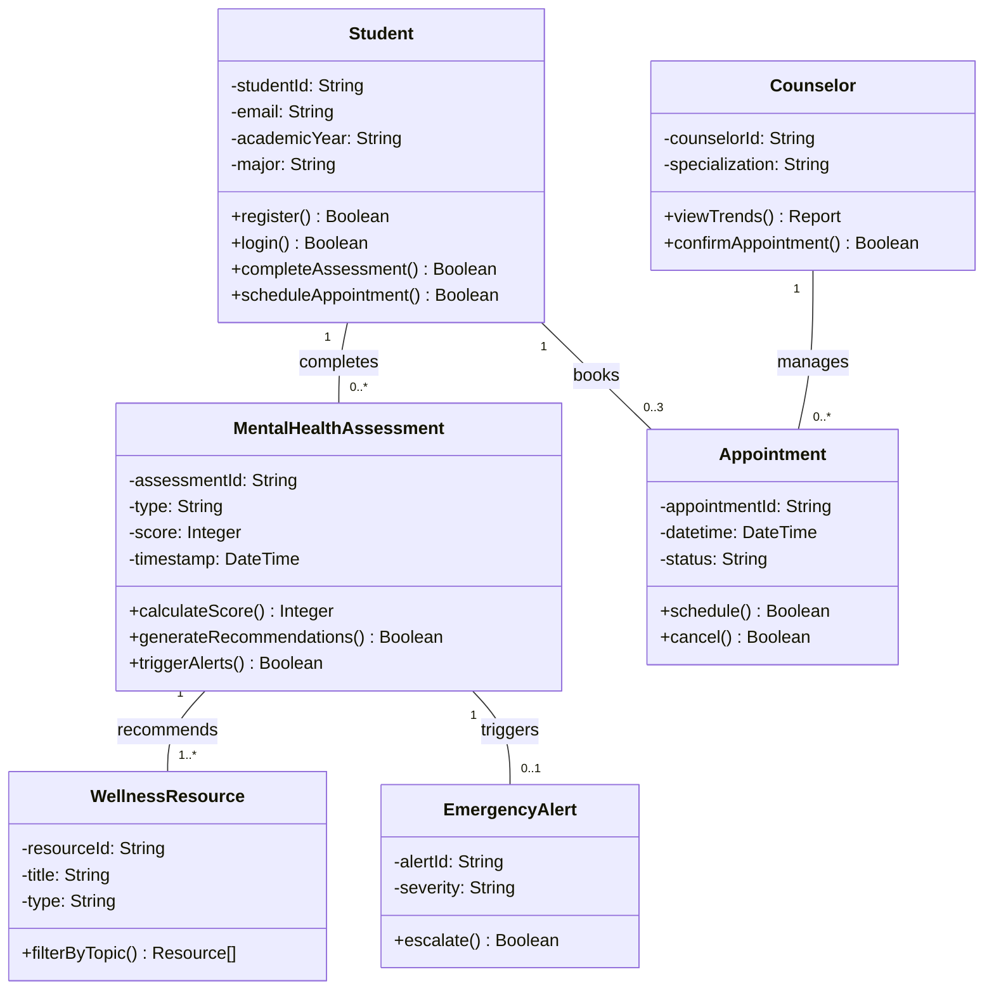

# Student Mental Wellness System- Class Diagram

# Explanation

## Overview
This class diagram models a Student Mental Wellness Academic Support System with 6 core classes and their relationships. The design directly implements requirements from the assignment while maintaining simplicity.

## Class Breakdown

### 1. Student
- **Attributes**:
  - `studentId`: Unique identifier
  - `email`: Institutional email (validated per FR1)
  - `academicYear`, `major`: Profile data (FR3)
- **Methods**:
  - Authentication: `register()`, `login()` (FR1-2)
  - Core functions: `completeAssessment()`, `scheduleAppointment()`

### 2. MentalHealthAssessment
- **Attributes**:
  - `type`: PHQ-9/GAD-7 (FR4)
  - `score`: Numeric result (thresholds in notes)
  - `timestamp`: When taken (FR5)
- **Methods**:
  - `calculateScore()`: Implements assessment logic
  - `generateRecommendations()`: Personalizes resources (FR7)
  - `triggerAlerts()`: Handles high-risk cases (FR4)

### 3. Counselor
- **Attributes**:
  - `counselorId`: Unique identifier
  - `specialization`: Area of expertise
- **Methods**:
  - `viewTrends()`: Analyzes anonymized data (FR9)
  - `confirmAppointment()`: Manages bookings

### 4. Appointment
- **Attributes**:
  - `datetime`: Scheduled time
  - `status`: Tracks lifecycle (Requested/Confirmed/Completed)
- **Methods**:
  - `schedule()`, `cancel()`: Booking management
- **Rules**:
  - Max 3 per student (multiplicity 0..3)
  - 24h cancellation (implied by status)

### 5. WellnessResource
- **Attributes**:
  - `type`: Article/Video
  - `title`: Display name
- **Methods**:
  - `filterByTopic()`: Stress/Anxiety/Depression (FR9)

### 6. EmergencyAlert
- **Attributes**:
  - `severity`: Risk level
- **Methods**:
  - `escalate()`: 5-min response protocol (FR20)

## Key Relationships

| Relationship | Multiplicity | Purpose |
|--------------|--------------|---------|
| Student → Assessment | 1 → 0..* | Tracks completion history |
| Student → Appointment | 1 → 0..3 | Enforces booking limits |
| Assessment → Resource | 1 → 1..* | Guarantees recommendations |
| Assessment → Alert | 1 → 0..1 | Optional risk escalation |

## Business Rule Implementation

1. **Access Control**:
   - Institutional email enforced in `Student.register()`
   - MFA implied in `login()`

2. **Assessment Protocol**:
   - Threshold checks in `triggerAlerts()`
   - Frequency control via `timestamp`

3. **Privacy**:
   - Counselor only accesses aggregated trends
   - No direct student-counselor link

## Design Trade-offs

1. **Simplicity vs Completeness**:
   - Omitted inheritance (not required)
   - Kept methods parameter-less for clarity

2. **State Management**:
   - Used basic `status` fields instead of State pattern
   - Matches your state diagrams

3. **Scalability**:
   - Resources can extend via `type` attribute
   - Alert system remains independent
