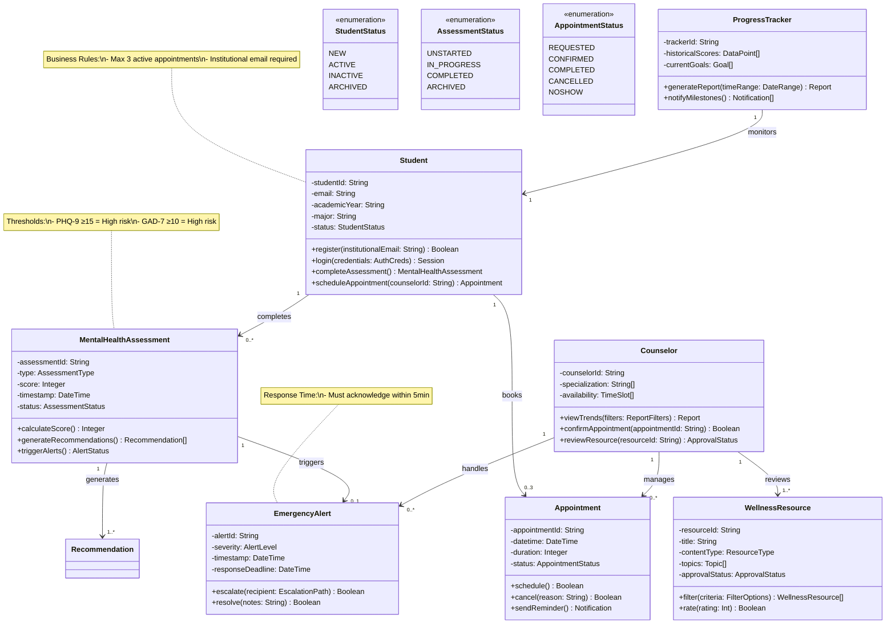
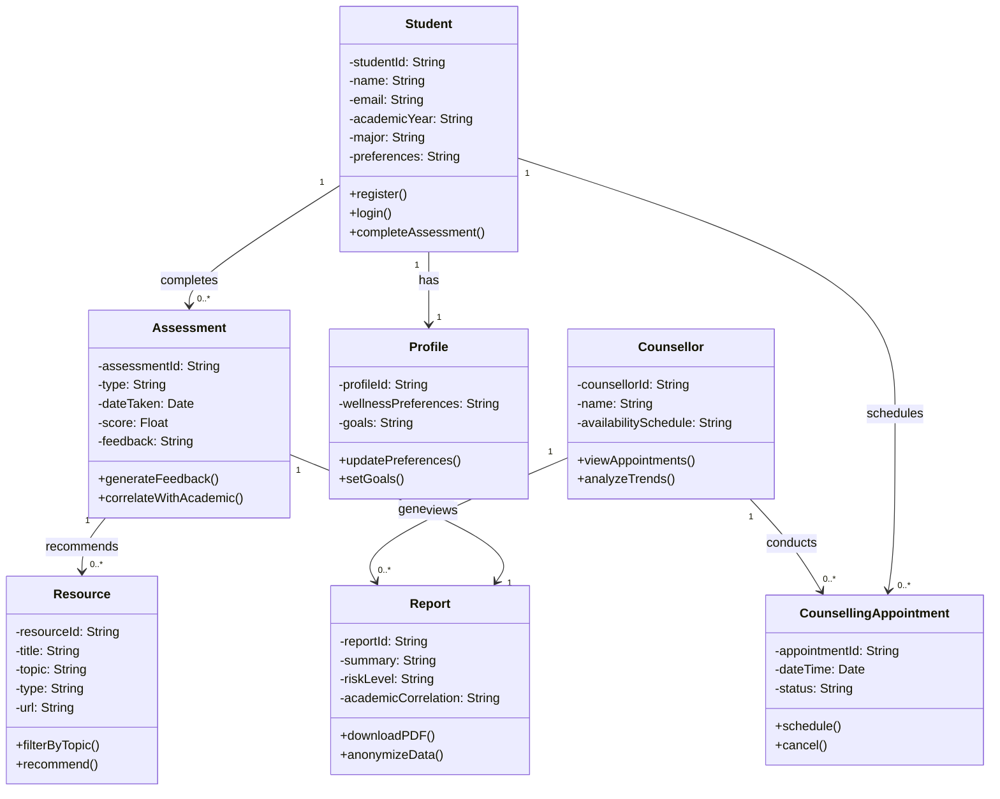
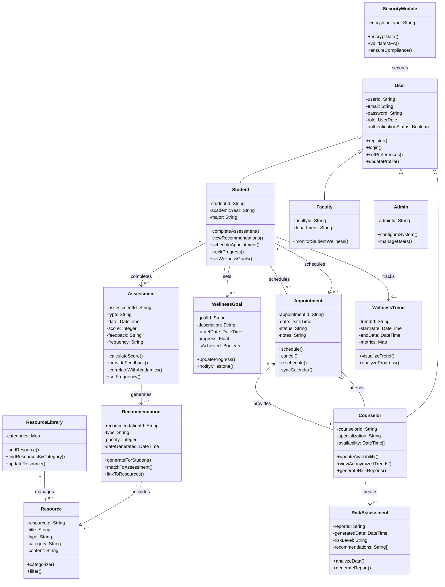

classDiagram
    %% Main Entities
    class Student {
        -studentId: String
        -email: String
        -academicYear: String
        -major: String
        -status: Enum[Active, Inactive]
        +register(institutionalEmail: String): Boolean
        +login(password, otp): Boolean
        +completeAssessment(): MentalHealthAssessment
        +scheduleAppointment(): Appointment
    }

class MentalHealthAssessment {
        -assessmentId: String
        -type: Enum[PHQ-9, GAD-7]
        -score: Integer
        -timestamp: DateTime
        -status: Enum[Unstarted, InProgress, Completed]
        +calculateScore(): Integer
        +generateRiskReport(): RiskLevel
        +triggerAlerts(): Boolean
    }

 class Counselor {
        -counselorId: String
        -specialization: String
        -availabilitySlots: TimeSlot[]
        +viewStudentTrends(): Report
        +confirmAppointment(): Boolean
        +reviewResource(): Boolean
    }

 %% Supporting Entities
    class Appointment {
        -appointmentId: String
        -datetime: DateTime
        -duration: Integer
        -status: Enum[Pending, Confirmed, Completed]
        +schedule(): Boolean
        +cancel(): Boolean
        +sendReminder(): Boolean
    }

 class WellnessResource {
        -resourceId: String
        -title: String
        -type: Enum[Article, Video]
        -topic: Enum[Stress, Anxiety, Depression]
        -approvalStatus: Enum[Pending, Approved]
        +filterByTopic(): WellnessResource[]
        +rateHelpfulness(): Boolean
    }

 class EmergencyAlert {
        -alertId: String
        -severity: Enum[Low, Medium, High]
        -triggerTime: DateTime
        -responseTime: DateTime
        +escalate(): Boolean
        +markResolved(): Boolean
    }

class ProgressTracker {
        -trackerId: String
        -wellnessScoreTrend: Float[]
        -goalCompletionRate: Float
        +generateTrendReport(): PDF
        +sendMilestoneNotifications(): Boolean
    }

 %% Relationships
    Student "1" -- "0..*" MentalHealthAssessment : completes
    Student "1" -- "0..3" Appointment : books
    Counselor "1" -- "0..*" Appointment : manages
    MentalHealthAssessment "1" -- "1..*" Recommendation : generates
    MentalHealthAssessment "1" -- "0..1" EmergencyAlert : triggers
    Counselor "1" -- "0..*" EmergencyAlert : handles
    Counselor "1" -- "1..*" WellnessResource : reviews
    ProgressTracker "1" -- "1" Student : monitors

 Explanation of Class Diagram

This class diagram represents the core structure of the Student Mental Wellness Academic Support System, visualizing the key entities, their attributes, methods, and how they interact.

Encapsulation: Each class includes attributes (data) and methods (behavior) relevant to its role. For example, Assessment stores scores and calculates feedback, while Student handles registration and assessment completion.

Relationships & Multiplicity:

A Student can complete many Assessments, but each Assessment belongs to one student (1 --> 0..*).

A Student has one Profile (composition), meaning the Profile depends on the Student.

Each Assessment can recommend multiple Resources, depending on the results.

A Counsellor can manage multiple CounsellingAppointments and view multiple Reports.

Design Patterns:

Composition is used where appropriate, such as the Profile belonging to a Student.

Association is used to represent flexible connections, like appointments between students and counsellors.

Privacy & Security: The diagram ensures role separation. For instance, counsellors can view anonymized Reports but do not directly access the Student class, supporting system privacy goals.

Scalability: The system is designed to be modular. New entities like Admin, SupportBot, or CrisisTeam can be added without disrupting the core structure.

This diagram directly reflects your system’s use cases and functional requirements and will guide the implementation phase by defining how the system's parts interact and evolve.


# Student Mental Wellness Academic Support System - Class Diagram



## Key Design Decisions

1. **User Inheritance Hierarchy**: The system implements a base User class with specialized subclasses (Student, Counselor, Faculty, Admin) to model different user roles while maintaining common functionality like authentication. This approach follows the "is-a" relationship principle of object-oriented design.

2. **Separation of Core Domain Objects**: The model clearly separates key domain concepts (Assessment, Recommendation, Resource, Appointment) as first-class entities, allowing each to evolve independently while maintaining clear relationships between them.

3. **Security as a Cross-Cutting Concern**: Rather than embedding security features in individual classes, a dedicated SecurityModule handles encryption, MFA validation, and compliance checks. This approach keeps security concerns separate from domain logic, supporting better modularity and the ability to change security implementations without affecting core functionality.

4. **Assessment-Recommendation-Resource Chain**: The design creates a clear flow from assessments to recommendations to resources, modeling how the system generates personalized support for students based on their mental health assessments.

5. **Tracking Mechanisms**: WellnessGoal and WellnessTrend classes support progress tracking at both the individual goal level and overall trend analysis, addressing the system's requirement to help students monitor their mental health progress over time.

6. **Appointment Scheduling**: The Appointment class acts as an association class connecting Students and Counselors, maintaining information about their interactions and supporting calendar synchronization.

7. **Resource Management**: A ResourceLibrary class manages and organizes resources, supporting the categorization and filtering requirements outlined in the functional specifications.

8. **Risk Assessment**: The RiskAssessment class enables counselors to analyze student data and identify potential risk factors while maintaining privacy through anonymization.

The class diagram uses standard UML multiplicity notation to show relationships between entities:
- "1" indicates exactly one instance
- "0..*" indicates zero to many instances 
- "1..*" indicates one to many instances
- "0..1" indicates zero or one instance

This design aligns with the system requirements by supporting user registration, assessment completion, personalized recommendations, resource access, appointment scheduling, and wellness tracking while maintaining security and privacy.
classDiagram
    class User {
        -userId: String
        -email: String
        -password: String
        -role: UserRole
        -authenticationStatus: Boolean
        +register()
        +login()
        +setPreferences()
        +updateProfile()
    }
    
    class Student {
        -studentId: String
        -academicYear: String
        -major: String
        +completeAssessment()
        +viewRecommendations()
        +scheduleAppointment()
        +trackProgress()
        +setWellnessGoals()
    }
    
    class Counselor {
        -counselorId: String
        -specialization: String
        -availability: DateTime[]
        +updateAvailability()
        +viewAnonymizedTrends()
        +generateRiskReports()
    }
    
    class Faculty {
        -facultyId: String
        -department: String
        +monitorStudentWellness()
    }
    
    class Admin {
        -adminId: String
        +configureSystem()
        +manageUsers()
    }
    
    class Assessment {
        -assessmentId: String
        -type: String
        -date: DateTime
        -score: Integer
        -feedback: String
        -frequency: String
        +calculateScore()
        +provideFeedback()
        +correlateWithAcademics()
        +setFrequency()
    }
    
    class Resource {
        -resourceId: String
        -title: String
        -type: String
        -category: String
        -content: String
        +categorize()
        +filter()
    }
    
    class Recommendation {
        -recommendationId: String
        -type: String
        -priority: Integer
        -dateGenerated: DateTime
        +generateForStudent()
        +matchToAssessment()
        +linkToResources()
    }
    
    class WellnessGoal {
        -goalId: String
        -description: String
        -targetDate: DateTime
        -progress: Float
        -isAchieved: Boolean
        +updateProgress()
        +notifyMilestone()
    }
    
    class Appointment {
        -appointmentId: String
        -date: DateTime
        -status: String
        -notes: String
        +schedule()
        +cancel()
        +reschedule()
        +syncCalendar()
    }
    
    class WellnessTrend {
        -trendId: String
        -startDate: DateTime
        -endDate: DateTime
        -metrics: Map
        +visualizeTrend()
        +analyzeProgress()
    }
    
    class RiskAssessment {
        -reportId: String
        -generatedDate: DateTime
        -riskLevel: String
        -recommendations: String[]
        +analyzeData()
        +generateReport()
    }
    
    class SecurityModule {
        -encryptionType: String
        +encryptData()
        +validateMFA()
        +ensureCompliance()
    }
    
    class ResourceLibrary {
        -categories: Map
        +addResource()
        +findResourcesByCategory()
        +updateResource()
    }

    User <|-- Student
    User <|-- Counselor
    User <|-- Faculty
    User <|-- Admin
    
    Student "1" --> "0..*" Assessment : completes
    Student "1" --> "0..*" WellnessGoal : sets
    Student "1" --> "0..*" Appointment : schedules
    Student "1" --> "0..1" WellnessTrend : tracks
    
    Assessment "1" --> "1..*" Recommendation : generates
    Recommendation "1" --> "1..*" Resource : includes
    
    ResourceLibrary "1" -- "0..*" Resource : manages
    
    Counselor "1" --> "0..*" RiskAssessment : creates
    Counselor "1" --> "0..*" Appointment : provides
    
    Appointment "0..*" -- "1" Student : schedules
    Appointment "0..*" -- "1" Counselor : attends
    
    SecurityModule -- User : secures
```mermaid
classDiagram
class User {
-userId: String
-name: String
+borrowBook()
+returnBook()
}
class Book {
-bookId: String
-title: String
-status: String
+checkOut()
+return()
}
class Loan {
-loanId: String
-dueDate: Date
+calculateFine()
}
User "1" -- "0..*" Loan : borrows
Book "1" -- "0..1" Loan : associatedWith
**Rendered Diagram:**
```mermaid
classDiagram
class User {
-userId: String
-name: String
+borrowBook()
+returnBook()
}
class Book {
-bookId: String
-title: String
-status: String
+checkOut()
+return()
}
class Loan {
-loanId: String
-dueDate: Date
+calculateFine()
}
User "1" -- "0..*" Loan : borrows
Book "1" -- "0..1" Loan : associatedWith
