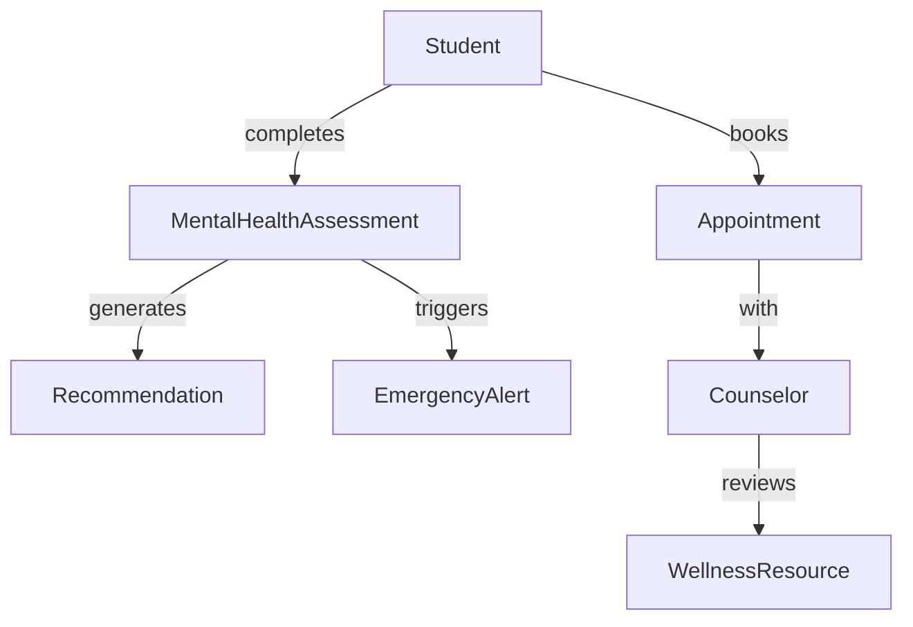

# Student Mental Wellness System - Domain Model

## Core Entities

| Entity               | Attributes                              | Methods                          | Relationships                     | Business Rules                          |
|----------------------|-----------------------------------------|----------------------------------|-----------------------------------|-----------------------------------------|
| **Student**         | `studentId`, `email`, `academicYear`, `major`, `status` | `register()`, `login()`, `completeAssessment()` | Initiates Assessments, Sets Goals, Books Appointments | Must use institutional email (FR1), Max 3 active appointments |
| **MentalHealthAssessment** | `assessmentId`, `type`, `score`, `timestamp`, `status` | `calculateScore()`, `generateRiskReport()` | Generates Recommendations, Triggers Alerts | PHQ-9 ≥15 triggers high-risk alert, Mandatory every 30 days |
| **Counselor**       | `counselorId`, `specialization`, `availabilitySlots` | `viewStudentTrends()`, `confirmAppointment()` | Conducts Appointments, Reviews Resources | 15-min response to high-risk alerts |
| **Appointment**     | `appointmentId`, `datetime`, `duration`, `status` | `schedule()`, `cancel()`, `sendReminder()` | Links Student and Counselor | 24h cancellation notice, Max 60min duration |
| **WellnessResource** | `resourceId`, `title`, `type`, `topic`, `approvalStatus` | `filterByTopic()`, `rateHelpfulness()` | Recommended via Assessments | Counselor approval required before publish |
| **EmergencyAlert**  | `alertId`, `severity`, `triggerTime`, `responseTime` | `escalate()`, `markResolved()` | Triggered by HighRisk Assessments | Must acknowledge within 5 minutes |
| **ProgressTracker** | `trackerId`, `wellnessScoreTrend`, `goalCompletionRate` | `generateTrendReport()`, `sendMilestoneNotifications()` | Monitors Student and Goals | Weekly notifications if progress <50% |

## Key Relationships

Business Rules Summary
Authentication:

Institutional email validation (FR1)

Multi-factor authentication (FR2)

Assessments:

PHQ-9 ≥15 → High-risk flag (FR4)

Mandatory reassessment every 30 days (FR5)

Appointments:

Max 3 active appointments per student

24-hour cancellation policy

Emergency Protocol:

5-minute alert acknowledgment (FR20)

Counselor escalation paths

Data Privacy:

Anonymized trend analysis (NRF7)

AES-256 encryption (NRF6)

Traceability
Entity	Related Requirements	Linked Use Cases
Student	FR1, FR2, FR15	Register, Track Goals
Assessment	FR4, FR5, FR6	Complete Assessment
Appointment	FR10, FR15	Schedule Counseling
EmergencyAlert	FR20	Generate Risk Reports

# Domain Model: Student Mental Wellness Academic Support System

| Entity | Attributes | Methods | Relationships |
|--------|------------|---------|----------------|
| **Student** | studentId, name, email, academicYear, major, preferences | register(), login(), completeAssessment() | Has many **Assessments**, has one **Profile**, schedules **CounsellingAppointments** |
| **Assessment** | assessmentId, type (PHQ-9/GAD-7), dateTaken, score, feedback | generateFeedback(), correlateWithAcademic() | Belongs to **Student**, generates **Report**, recommends **Resources** |
| **Profile** | profileId, wellnessPreferences, goals | updatePreferences(), setGoals() | Belongs to **Student** |
| **Resource** | resourceId, title, topic, type, url | filterByTopic(), recommend() | Recommended by **Assessment** |
| **Counsellor** | counsellorId, name, availabilitySchedule | viewAppointments(), analyzeTrends() | Has many **CounsellingAppointments**, views **Reports** |
| **CounsellingAppointment** | appointmentId, dateTime, status | schedule(), cancel() | Belongs to **Student** and **Counsellor** |
| **Report** | reportId, summary, riskLevel, academicCorrelation | downloadPDF(), anonymizeData() | Generated from **Assessment**, viewed by **Counsellor** and **Admin** |

## Business Rules
- A student can schedule **one counselling appointment per day**.
- Each student can complete **only one assessment per type (PHQ-9/GAD-7) per week**.
- An assessment must generate **real-time feedback within 2 seconds**.
- Each student can have **only one active wellness goal** at a time.
- Resources must be **filterable by topic** (e.g., stress, anxiety, depression).
- Counselors only access **anonymized data** unless explicitly authorized.
- **High-risk assessments** must trigger an alert to a counselor within 5 minutes.
- Reports must be **downloadable in PDF format** for sharing with counselors or academic advisors.

# Student Mental Wellness Academic Support System - Domain Model

## Key Domain Entities

| Entity | Attributes | Methods | Relationships |
|--------|------------|---------|---------------|
| Student | - studentId: String - email: String - password: String - academicYear: String - major: String - authenticationStatus: Boolean | - register() - login() - completeAssessment() - viewRecommendations() - scheduleAppointment() - trackProgress() - setWellnessGoals() | - Completes Assessments - Receives Recommendations - Schedules Appointments with Counselors - Sets WellnessGoals - Tracks WellnessTrends |
| Assessment | - assessmentId: String - type: String (PHQ-9/GAD-7) - date: DateTime - score: Integer - feedback: String - frequency: String | - calculateScore() - provideFeedback() - correlateWithAcademics() - setFrequency() | - Completed by Student - Generates Recommendations - Associated with WellnessTrend |
| Recommendation | - recommendationId: String - type: String - priority: Integer - dateGenerated: DateTime | - generateForStudent() - matchToAssessment() - linkToResources() | - Generated from Assessment - Includes Resources - Provided to Student |
| Resource | - resourceId: String - title: String - type: String - category: String - content: String | - categorize() - filter() | - Included in Recommendations - Categorized by topic |
| Counselor | - counselorId: String - email: String - password: String - specialization: String - availability: DateTime[] | - login() - updateAvailability() - viewAnonymizedTrends() - generateRiskReports() | - Has Appointments with Students - Creates RiskAssessments |
| Appointment | - appointmentId: String - date: DateTime - status: String - notes: String | - schedule() - cancel() - reschedule() - syncCalendar() | - Between Student and Counselor |
| WellnessGoal | - goalId: String - description: String - targetDate: DateTime - progress: Float - isAchieved: Boolean | - updateProgress() - notifyMilestone() | - Set by Student |

## Business Rules

1. Registration requires an institutional email address (validated by domain)
2. All user logins require two-factor authentication (password + OTP)
3. Assessments generate personalized recommendations within 2 seconds of completion
4. Students can customize the frequency of their assessments (daily/weekly/monthly)
5. Resources are categorized by topic (stress, anxiety, depression) with 100% filtering accuracy
6. Students can set and track mental wellness goals, receiving notifications upon reaching milestones
7. Counselors can view anonymized wellness trends but no personally identifiable information
8. The system correlates mental health metrics with academic performance indicators
9. All user data is encrypted using AES-256
10. The system must handle 1,000 concurrent users during peak hours
11. System availability must be maintained at 99.5% during academic terms
