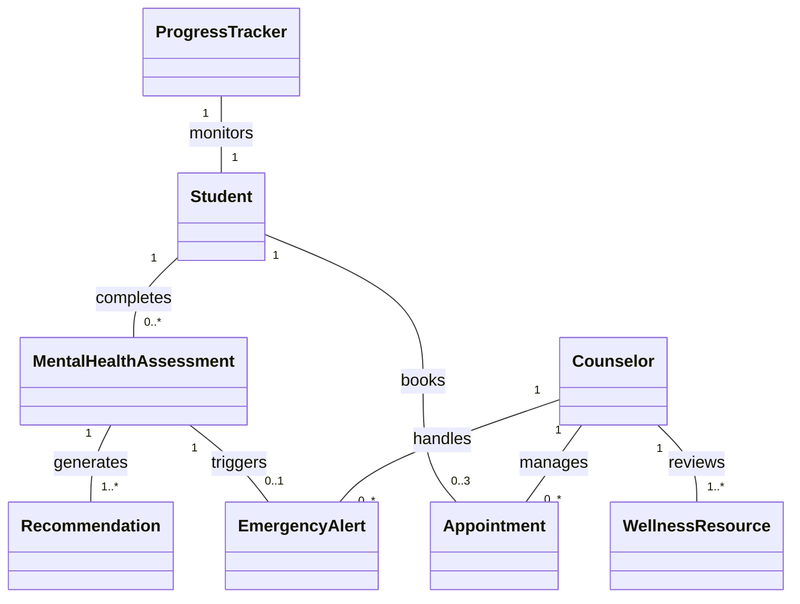

# Student Mental Wellness System - Domain Model

## Core Domain Entities

| Entity               | Attributes                              | Methods                          | Relationships                     | Business Rules                          |
|----------------------|-----------------------------------------|----------------------------------|-----------------------------------|-----------------------------------------|
| **Student**         | `studentId: String` `email: String` `academicYear: String` `major: String` `status: Enum[Active, Inactive]` `preferences: String[]` `authenticationStatus: Boolean` | `register()` `login()` `completeAssessment()` `scheduleAppointment()` `trackProgress()` `setWellnessGoals()` | Completes Assessments Books Appointments Sets Goals Receives Recommendations | 1. Institutional email required (FR1) 2. Max 3 active appointments 3. One assessment per type per week |
| **MentalHealthAssessment** | `assessmentId: String` `type: Enum[PHQ-9, GAD-7]` `score: Integer` `timestamp: DateTime` `status: Enum[Pending, Completed]` `feedback: String` `frequency: String` | `calculateScore()` `generateRiskReport()` `provideFeedback()` `correlateWithAcademics()` | Generates Recommendations Triggers Alerts Links to WellnessTrend | 1. PHQ-9 ≥15 = High risk (FR4) 2. Mandatory every 30 days 3. Real-time feedback within 2s |
| **Counselor**       | `counselorId: String` `specialization: String[]` `availabilitySlots: TimeSlot[]` `email: String` | `viewStudentTrends()` `confirmAppointment()` `updateAvailability()` `generateRiskReports()` | Manages Appointments Reviews Resources Handles Alerts | 1. 15-min response to high-risk alerts 2. Only anonymized data access |
| **Appointment**     | `appointmentId: String` `datetime: DateTime` `duration: Integer` `status: Enum[Pending, Confirmed, Completed]` `notes: String` | `schedule()` `cancel()` `sendReminder()` `syncCalendar()` | Links Student and Counselor | 1. 24h cancellation notice 2. Max 1 per day 3. 60min duration limit |
| **WellnessResource** | `resourceId: String` `title: String` `type: Enum[Article, Video]` `topic: Enum[Stress, Anxiety, Depression]` `content: String` `approvalStatus: Enum[Pending, Approved]` | `filterByTopic()` `rateHelpfulness()` `categorize()` | Recommended via Assessments | 1. Counselor approval required 2. Filterable by topic with 100% accuracy |
| **EmergencyAlert**  | `alertId: String` `severity: Enum[Low, Medium, High]` `triggerTime: DateTime` `responseTime: DateTime` | `escalate()` `markResolved()` | Triggered by HighRisk Assessments | 1. Must acknowledge within 5min (FR20) 2. Auto-escalate if unacknowledged |
| **ProgressTracker** | `trackerId: String` `wellnessScoreTrend: DataPoint[]` `goalCompletionRate: Float` `currentGoals: Goal[]` | `generateTrendReport()` `sendMilestoneNotifications()` `updateProgress()` | Monitors Student and Goals | 1. Weekly notifications if progress <50% 2. PDF report generation |

## Key Relationships with Multiplicity

# Business Rules

## Access Control Rules
1. **User Registration**
   - `BR-AC-001`: Students must register using a valid institutional email address (domains must be pre-approved)
   - `BR-AC-002`: All accounts require multi-factor authentication (password + OTP)

2. **Authentication**
   - `BR-AC-003`: Accounts lock after 3 failed login attempts for 24 hours
   - `BR-AC-004`: Session timeout after 30 minutes of inactivity

## Assessment Rules
3. **Assessment Frequency**
   - `BR-AS-001`: Students may complete only one PHQ-9 assessment per week
   - `BR-AS-002`: Students may complete only one GAD-7 assessment per week
   - `BR-AS-003`: Mandatory reassessment every 30 days for at-risk students

4. **Risk Thresholds**
   - `BR-AS-004`: PHQ-9 score ≥15 automatically triggers high-risk alert
   - `BR-AS-005`: GAD-7 score ≥10 automatically triggers medium-risk alert
   - `BR-AS-006`: Assessment feedback must generate within 2 seconds of completion

## Appointment Rules
5. **Scheduling Limits**
   - `BR-AP-001`: Students may have maximum 3 active appointments at any time
   - `BR-AP-002`: Only 1 counseling appointment may be scheduled per day
   - `BR-AP-003`: Minimum 24-hour notice required for cancellations

6. **Duration Rules**
   - `BR-AP-004`: Standard appointment duration is 60 minutes
   - `BR-AP-005`: Emergency appointments may extend to 90 minutes

## Resource Rules
7. **Content Management**
   - `BR-RS-001`: All resources require counselor approval before publication
   - `BR-RS-002`: Resources must be categorized by topic (stress/anxiety/depression)
   - `BR-RS-003`: Resources auto-archive after 90 days of low usage (<5 views)

## Emergency Protocol
8. **Alert Handling**
   - `BR-EM-001`: High-risk alerts must be acknowledged within 5 minutes
   - `BR-EM-002`: Unacknowledged alerts escalate to campus security after 15 minutes
   - `BR-EM-003`: All alert responses must be documented in the system

## Data Management
9. **Privacy & Security**
   - `BR-DM-001`: Counselors only access anonymized student data
   - `BR-DM-002`: All data transfers must use AES-256 encryption
   - `BR-DM-003`: Personal data automatically purges after 2 years of inactivity

10. **System Performance**
    - `BR-DM-004`: System must support 1,000 concurrent users
    - `BR-DM-005`: Page load time cannot exceed 3 seconds
    - `BR-DM-006`: 99.5% uptime during academic terms (Aug-May)

## Goal Tracking
11. **Progress Monitoring**
    - `BR-GT-001`: Students may have only 1 active wellness goal at a time
    - `BR-GT-002`: Weekly notifications sent if progress <50%
    - `BR-GT-003`: Goal achievement triggers celebration notification

## Enforcement Mechanisms
| Rule ID | Verification Method | Responsible Party |
|---------|---------------------|-------------------|
| BR-AC-001 | Email domain validation | System |
| BR-AS-004 | Automated score analysis | Assessment Engine |
| BR-AP-001 | Appointment count check | Scheduling Service |
| BR-EM-001 | Response timer | Alert Monitor |
| BR-DM-002 | Encryption audit | Security Team |
