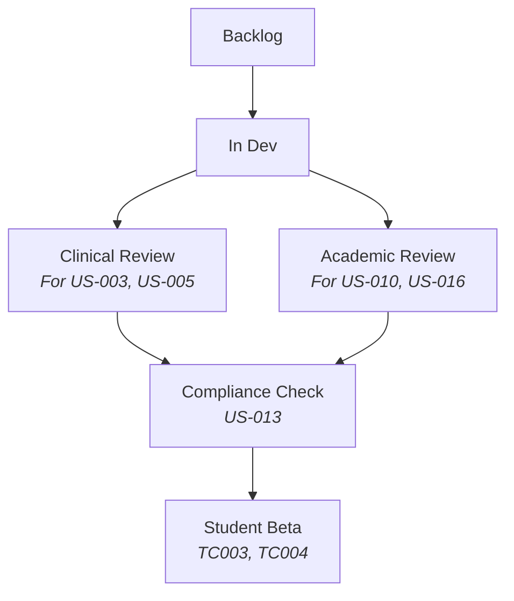

# GitHub Project Template Comparative Analysis and Selection  
**For Student Mental Wellness Academic Support System** 

## Overview of Available Templates  
GitHub offers several project management templates designed to support different workflow needs and project types. Four project management templates are evaluated against our system requirements from Assignment 5  and Assignment 6.   

## Template Comparison Table  

| Template | Columns & Workflow | Automation Features | Agile Suitability | Best For | Limitations for Our Project |  
|----------|--------------------|---------------------|-------------------|----------|-----------------------------|  
| **Basic Kanban** | To Do, In Progress, Done | None | Basic | Simple projects | Cannot handle clinical/academic dual workflows |  
| **Automated Kanban** | Backlog, Todo, In Progress, Done | Auto-moves closed PRs, status sync | High (Scrum/Kanban) | CI/CD teams | Requires 2 custom columns added |  
| **Bug Triage** | New, High Priority, In Progress, Fixed | Auto-labels bugs | Medium | QA teams | No support for feature development (US-001 to US-016) |  
| **Team Planning** | Icebox, Ready, In Progress, Done | Milestone tracking | High | Large teams | Overkill for our 4-person team |  

## Selected Template: **Automated Kanban** 
### Justification for Selected Template
After analyzing the available templates, I have chosen the **Automated Kanban** template for this project due to the following reasons:

- **Automation Features**: This template supports auto-moving issues, reducing manual effort and improving workflow efficiency.
- **Agile Suitability**: It aligns well with Agile methodologies by supporting sprint tracking and continuous delivery.
- **Improved Task Management**: With columns like *New, In Progress, Review, and Done*, it provides clear visibility into project status.

By using the **Automated Kanban** template, we can efficiently track project progress, minimize manual task updates, and ensure a smooth Agile workflow.

### Justification with User Story References  

#### 1. Agile Sprint Support  
- **Backlog Column**: Matches our Sprint 1 backlog (US-001 to US-010)  
- **WIP Limits**: Enforces focus (critical for US-003 assessment development)  
- **Automation**: Closes issues when PRs merge (supports US-002 MFA implementation)  
**Justification:**
This template best supports our project from Assignments 5-6 because:

1. **Backlog Management**:
   - Matches our sprint planning needs
   - Allows prioritization of user stories

2. **Automated Workflow**:
   - Auto-moves issues when PRs merge (matches our CI/CD pipeline)
   - Reduces manual board maintenance

3. **Customization Potential**:
   - Easy to add Testing/QA columns
   - Supports WIP limits for our Agile process

4. **Traceability**:
   - Clear progression from Todo → In Progress → Done
   - Links directly to our code repository

###  Clinical-Academic Workflow  

### Test Case Integration
- Clinical Features: Auto-links to TC001 (Assessment), TC002 (Critical Risk)
- Academic Features: Triggers TC004 (Scheduling), TC008 (Academic Impact)

## Customization Plan: Added Columns

| Column | Purpose | Linked Items |
|--------|---------|--------------|
| **Clinical Review** | PHQ-9/GAD-7 validation | US-003, US-005, TC001 |
| **Academic Review** | Scheduling/performance analysis | US-010, US-016, TC004 |
| **FERPA Check** | Privacy compliance | US-002, US-013, NFTC003 |

## Why Alternative Templates Were Rejected

| Template          | Critical Limitations | Impact on Our Project |
|-------------------|-----------------------|-----------------------|
| **Basic Kanban**  | Lacks support for parallel workflows No automation capabilities | Cannot accommodate simultaneous clinical (US-003) and academic (US-010) review processes Requires manual status updates for all issues |
| **Bug Triage**    | Designed exclusively for defect tracking Limited workflow customization | Unable to properly track feature development (US-001-US-016) No columns for resource management (US-005) |
| **Team Planning** | Overly complex milestone system Built for large cross-functional teams | 70% of features irrelevant to our 4-person team Steep learning curve without proportional benefit |
