# Activity Workflow Diagrams
# 1. Student Registration & Authentication  
**Swimlanes**: Student, System, Database  

## 1. Student Registration & Authentication  
**Swimlanes**: Student, System, Database  

```mermaid
flowchart TD
    start([Start]) --> A[Enter Email] --> B{{"Valid institutional email?"}}
    B -->|Yes| C[Send OTP] --> D[Input Profile Data]
    B -->|No| E[Show Error] --> end([End])
    D --> F{{"All mandatory fields complete?"}}
    F -->|Yes| G[Encrypt & Save Profile] --> H[Confirm Registration]
    F -->|No| I[Prompt Completion] --> D
    H --> end
```
**Stakeholder Value**:  
- Ensures only verified students access the system (**FR1, NRF7**).  
- MFA and encryption meet security standards (**FR2, NRF6**).  

---
# Activity Workflow Diagrams

## 1. Student Registration & Authentication  
**Swimlanes**: Student, System, Database  


## 2. PHQ-9/GAD-7 Assessment Flow  
**Swimlanes**: Student, System, Counselor  

```mermaid
flowchart TD
    start([Start]) --> A[Display Questions]
    A --> B[Student Answers]
    B --> C{"All questions answered?"}
    C -->|No| D[Save Progress] --> B
    C -->|Yes| E[Calculate Scores]
    E --> F[Generate Recommendations]
    F --> G[Display Dashboard] --> end1([End])
    E -->|Score ≥8| H[Alert Counselor] --> I[High-Risk Protocol] --> end2([End])
```


## 3. Academic-Mental Health Correlation  
**Swimlanes**: System, Database  


## 4. Crisis Resource Delivery  
**Swimlanes**: System, Student  


## 5. Progress Tracking & Goal Updates  
**Swimlanes**: Student, System  


## 6. Counselor High-Risk Case Handling  
**Swimlanes**: Counselor, System, Campus Safety  


## 7. Study Guide Generation  
**Swimlanes**: System, Database  


## 8. Automated Backup & Compliance  
**Swimlanes**: System, Admin  

