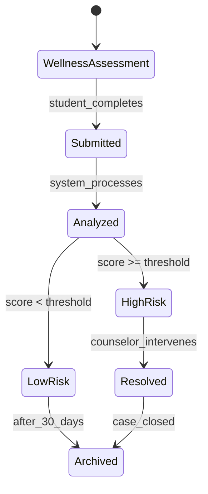
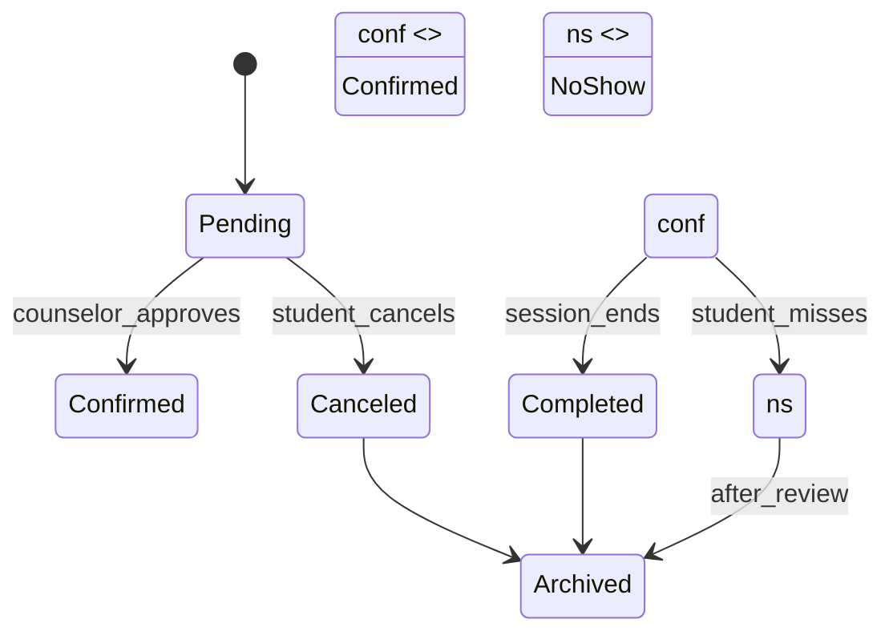

# 1. Wellness Assessment

```mermaid
stateDiagram-v2
    [*] --> WellnessAssessment
    WellnessAssessment --> Submitted: student_completes
    Submitted --> Analyzed: system_processes
    Analyzed --> HighRisk: score >= threshold
    Analyzed --> LowRisk: score < threshold
    HighRisk --> Resolved: counselor_intervenes
    LowRisk --> Archived: after_30_days
    Resolved --> Archived: case_closed
```
# 2. Wellness Appointment

```mermaid
stateDiagram-v2
    [*] --> Pending
    Pending --> Confirmed: counselor_approves
    Pending --> Canceled: student_cancels
    
    state "Confirmed" as conf <<blue>>
    state "NoShow" as ns <<orange>>
    
    conf --> Completed: session_ends
    conf --> ns: student_misses
    ns --> Archived: after_review
    Completed --> Archived
    Canceled --> Archived
```
