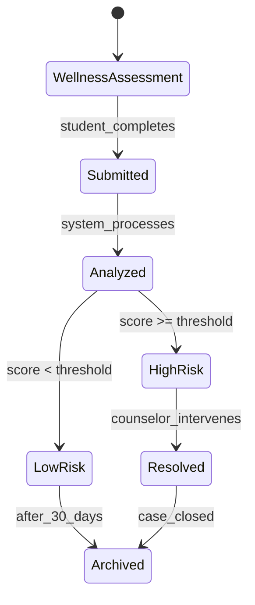
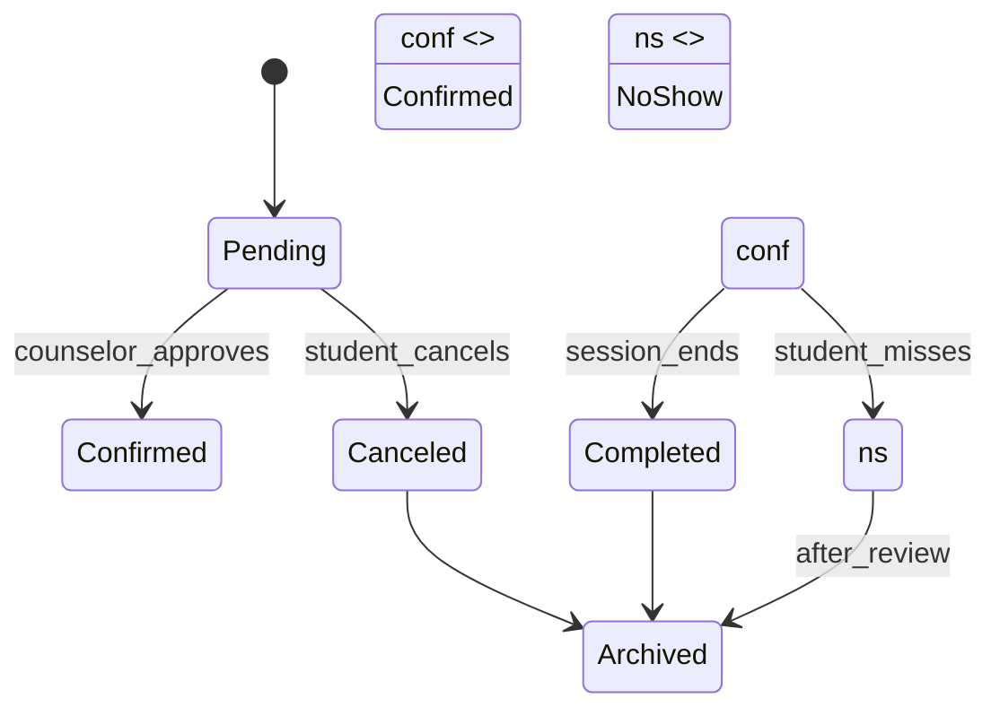
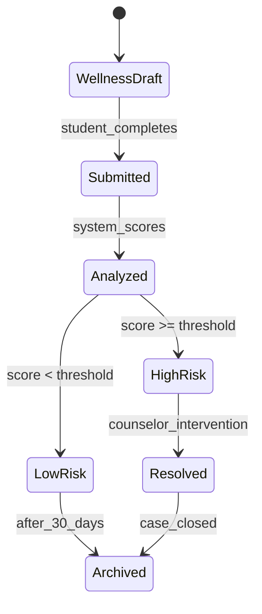
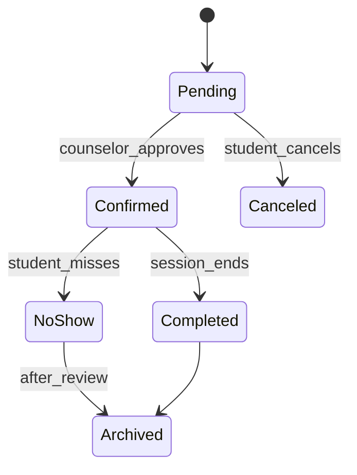
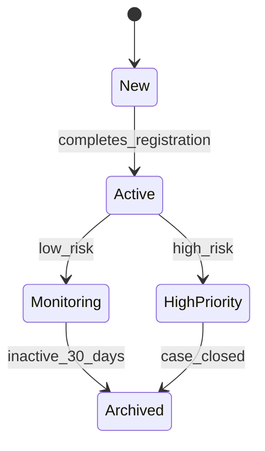
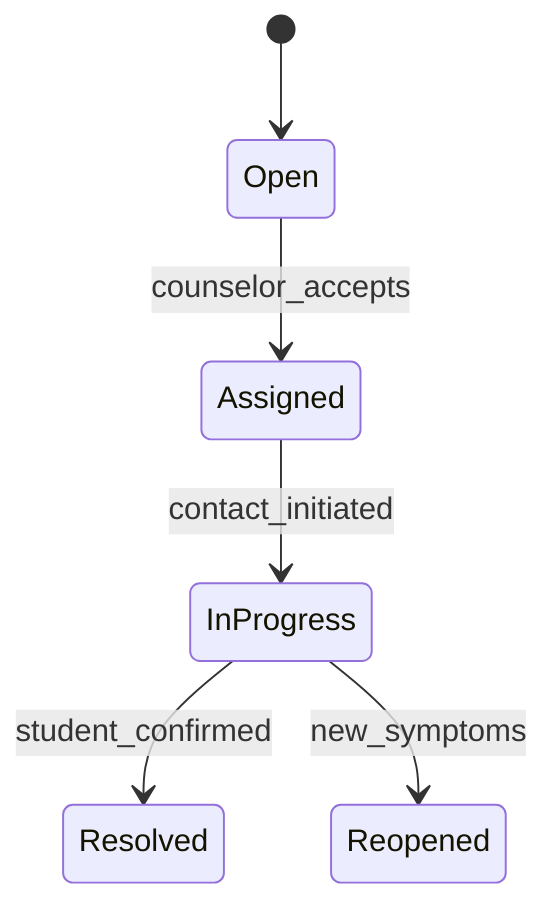
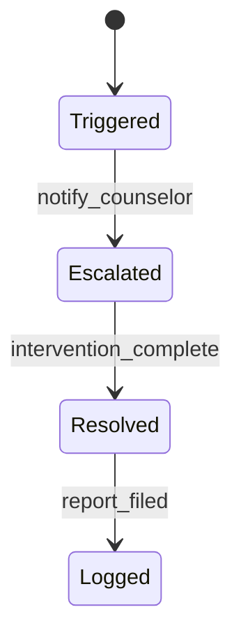
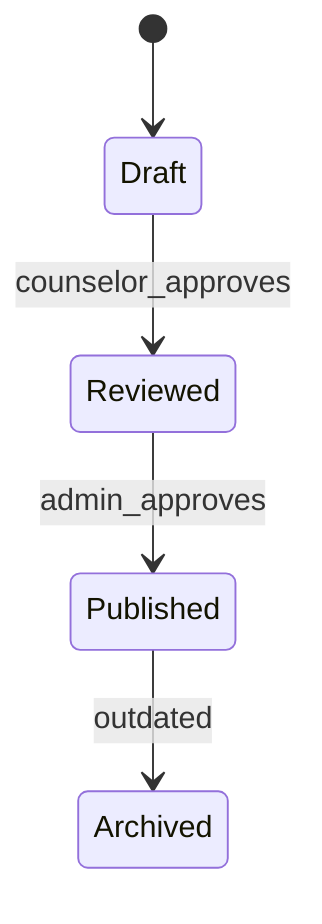
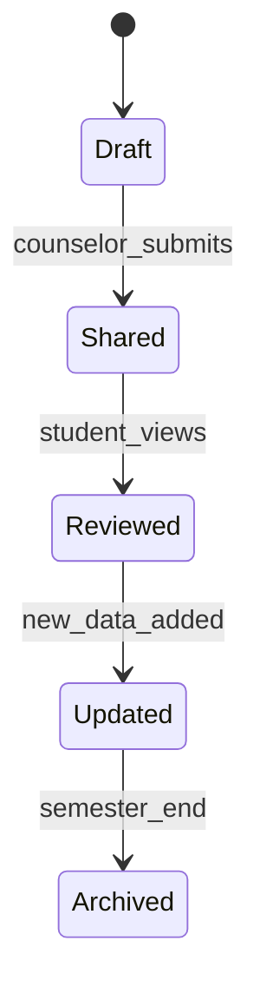

# 1. Wellness Assessment

# 2. Wellness Appointment

# State Transition Diagrams

## 1. Wellness Assessment

**Explanation**:  
- **Key States**: `HighRisk` (requires counselor action), `LowRisk` (auto-archived after 30 days).  
- **Links to**: FR-04 (Automated scoring), UC-01 (Complete Assessment).  

---

## 2. Wellness Appointment

**Explanation**:  
- **Critical Transition**: `NoShow` state triggers follow-up (FR-30).  

---

## 3. Student Wellness Profile

---

## 4. Counselor Wellness Case

---

## 5. Wellness Emergency Alert

---

## 6. Wellness Resource

---

## 7. Wellness Progress Report

