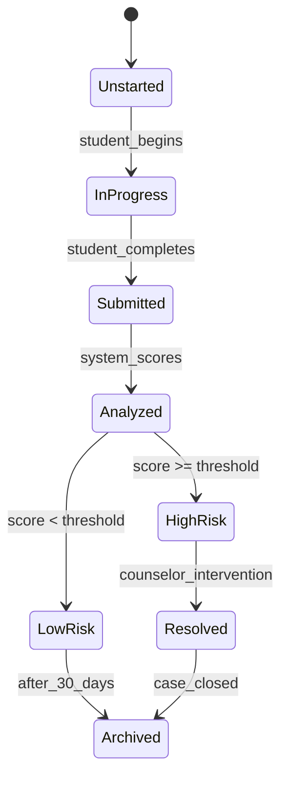
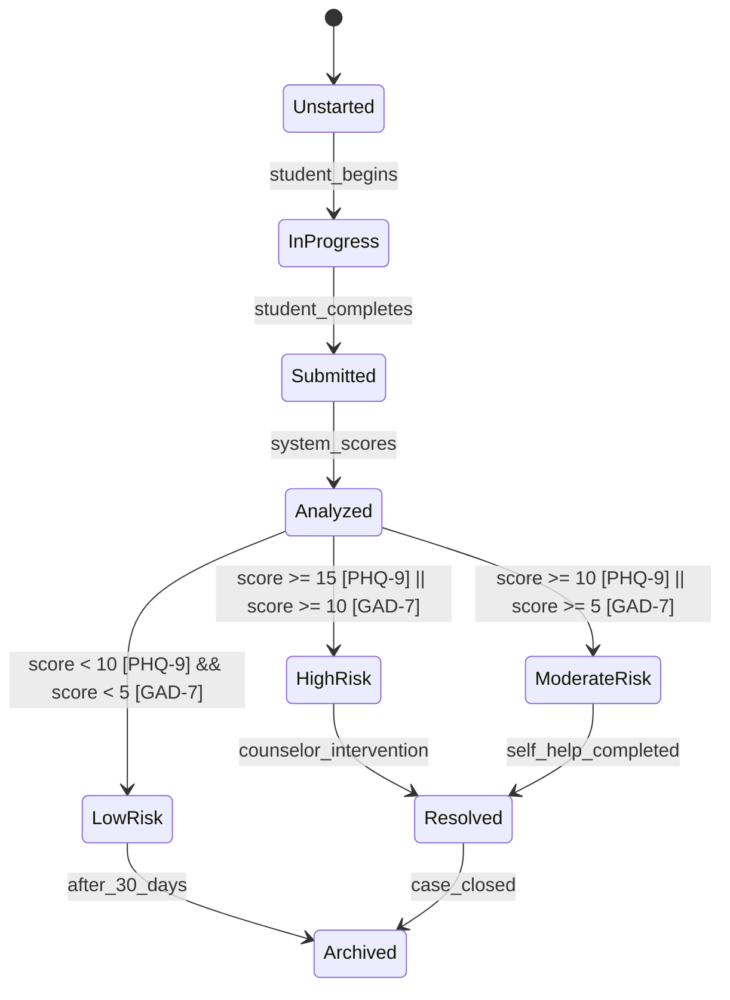
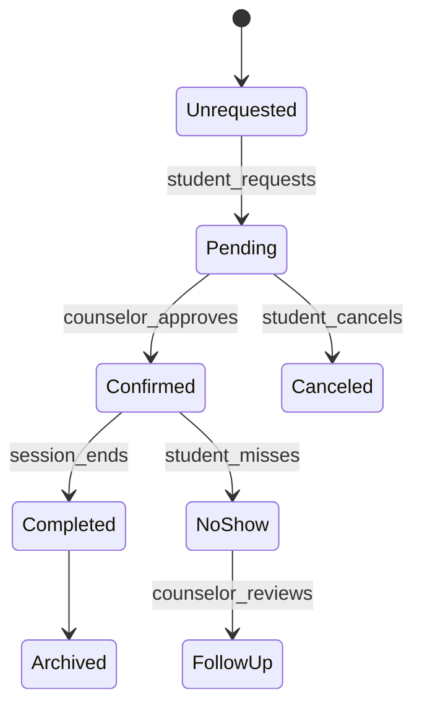
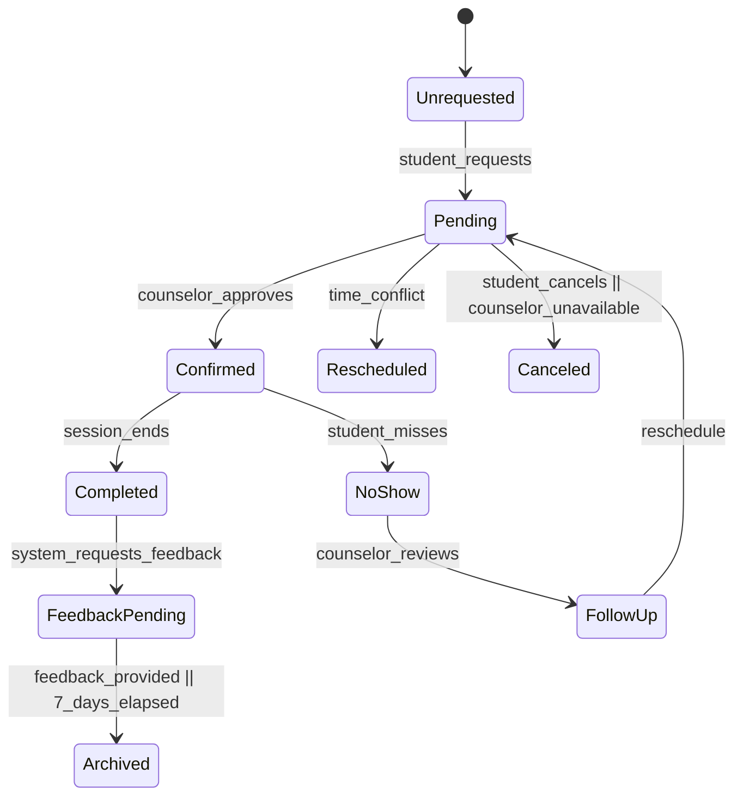
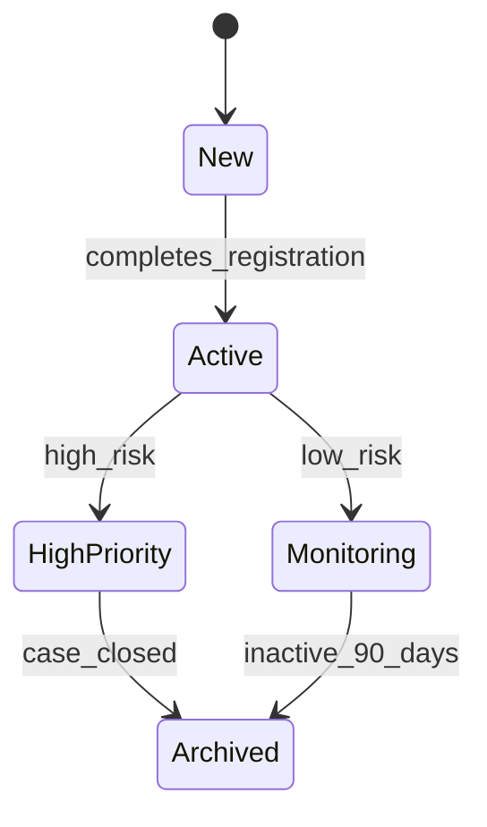
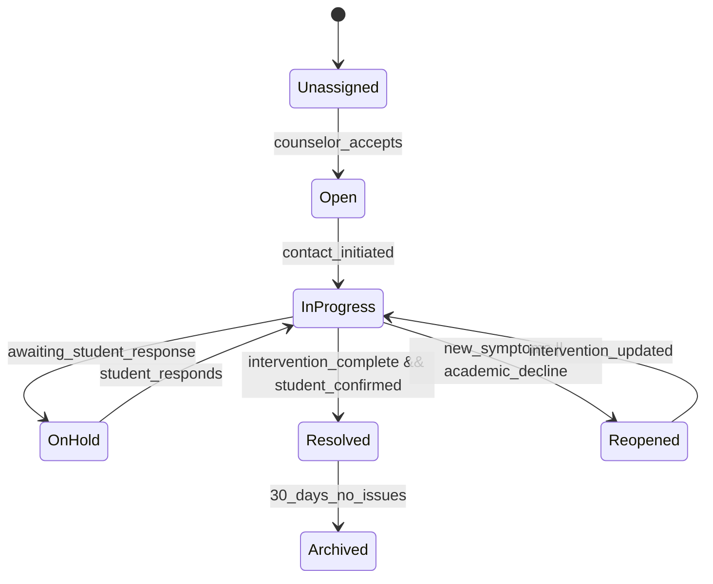
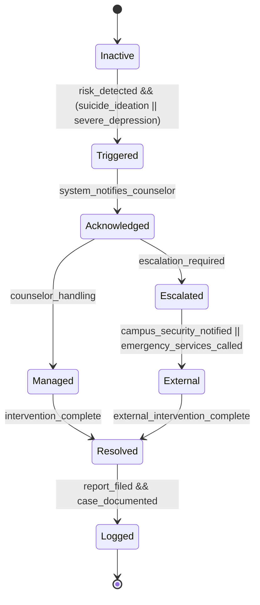
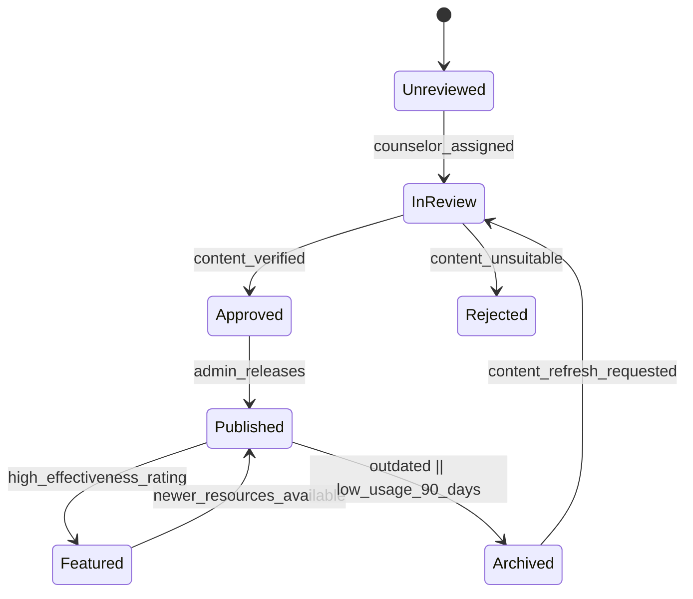
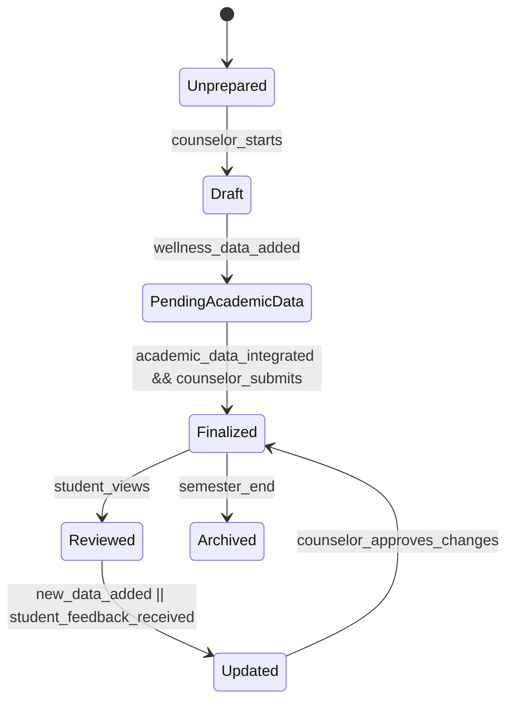
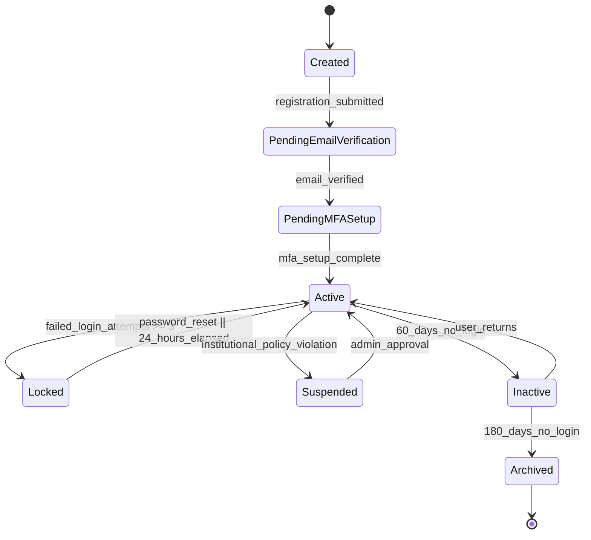

# Student Wellness System - State Transition Diagrams

## 1. Wellness Assessment

**Key States**:  
- `Unstarted` → `InProgress`: Tracks active assessment (FR-04)  
- `HighRisk`: Triggers counselor alerts (UC-03)  

---

## 2. Counseling Appointment

**Critical Flow**:  
- `NoShow` → `FollowUp`: Addresses missed sessions (FR-15)  

---

## 3. Student Wellness Profile

**Note**:  
- `HighPriority` requires counselor attention (FR-09)  

---

## 4. Counselor Case File

**Workflow**:  
- `Reopened` state handles recurring issues (UC-07)  

---

## 5. Emergency Alert

**Protocol**:  
- `Triggered` within 5 minutes of detection (FR-20)  

---

## 6. Wellness Resource

**Control**:  
- Dual approval process (FR-25)  

---

## 7. Progress Report

**Lifecycle**:  
- `Updated` allows iterative improvements (FR-33)
# 8. User Account 

## State Diagrams Explanation  
[See explanation](https://github.com/ZiyandaPetela/Student_Mental_Wellness_Academic_Support_System/blob/main/state_and_workflow_modeling/workflow_explanations.md)  
